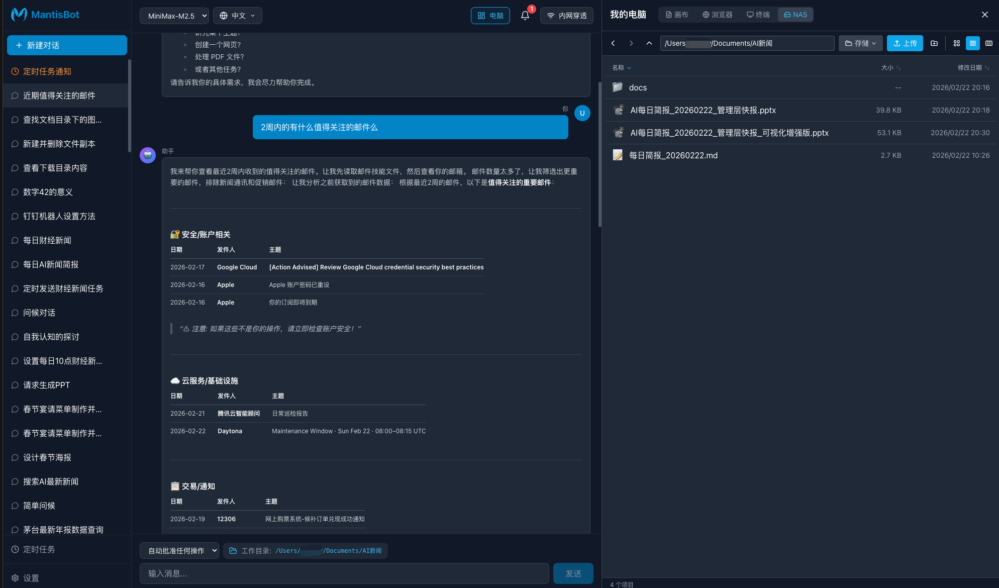
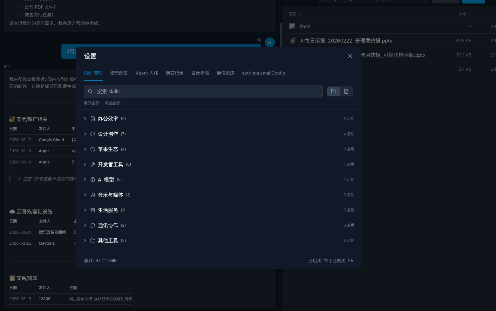
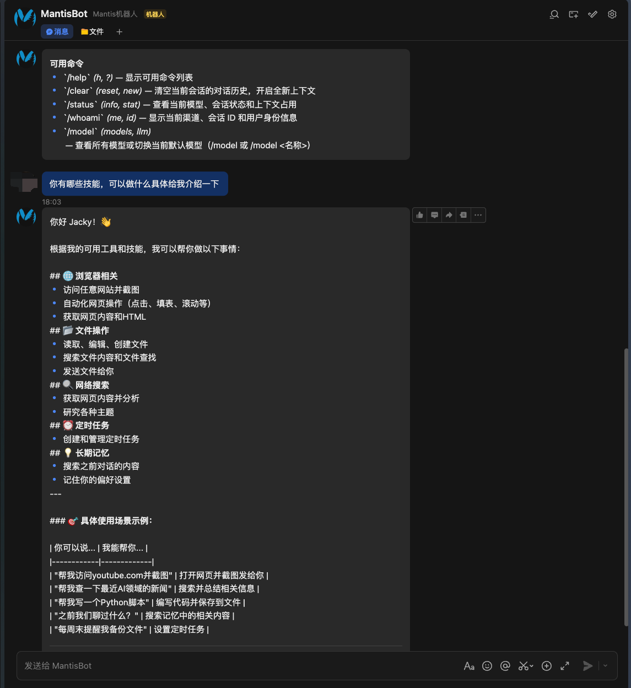

# MantisBot


<!-- GitHub 显示 -->

<picture>
  <source media="(prefers-color-scheme: dark)" srcset="https://raw.githubusercontent.com/necboy/MantisBot/main/assets/logo.svg">
  
</picture>

**An AI Agent platform for personal and work use, optimized and built based on the OpenClaw framework and concepts**

Supports multiple communication channels and LLM models, with 40+ built-in practical skills (including PDF + Office suite integration), OnlyOffice integration for online Office file editing, and the ability to use your personal computer as a remote storage NAS to build personal and work AI knowledge bases

---

**一个基于OpenClaw框架和思路优化并构建的个人+工作 AI Agent 平台**

支持多种通信渠道和 LLM 模型，内置 40+ 实用技能（包括集成PDF+Office三件套技能），集成 OnlyOffice 实现在线 Office 文件编辑，同时可以将安装的个人电脑作为远程存储 NAS 进行使用，构建个人及工作的 AI 知识库

[](LICENSE)
[](https://nodejs.org/)
[](https://www.typescriptlang.org/)

[English](#english) | [中文文档](#中文文档)

</div>

---

## English

### 🎯 Introduction

MantisBot is a **modular AI Agent platform** for individual users, developers, and enterprises. Unlike OpenClaw and other consumer-focused products, MantisBot focuses on:

- **Enterprise Architecture** - Highly modular design, easy to extend and customize
- **Convenient Configuration** - Highly configurable frontend interface
- **Unified Multi-Model Management** - Supports OpenAI, Claude, Qwen, MiniMax, GLM, and more, better suited for China's domestic ecosystem
- **Skill Ecosystem** - 40+ built-in skills, ready to use
- **Smart Memory System** - Hybrid retrieval (vector + full-text), better understanding

### ✨ Features

- **🔌 Channel-First Architecture** - Unified IChannel interface supporting Web UI, Feishu, DingTalk, Slack, and more (Overseas IM tools not yet tested, use with caution)
- **🤖 Multi-Model Support** - OpenAI, Claude, Qwen, MiniMax, GLM, etc.
- **🛠️ 40+ Built-in Skills** - Document processing, office automation, deep research, etc.
- **🧠 Smart Memory System** - Hybrid search with vector + full-text retrieval
- **⏰ Scheduled Tasks** - Cron, interval, and one-time scheduling
- **📦 Plugin System** - Dynamic plugin loading with MCP protocol support
- **🛡️ Reliability** - Circuit breaker, retry management, global error handling
- **🌐 Tunnel Services and Domain Forwarding** - DDNS.to, Cloudflare Tunnel, FRP support

### 📸 System Preview

**System Interface**


**Skill Packages**


**Feishu & IM Integration**


### 💡 Typical Use Cases

MantisBot's 40+ skills cover various aspects of work and life:

#### 📄 Document Processing & Office Automation

| Scenario | Skill |
|----------|-------|
| Read/analyze PDF, extract text/tables | `pdf` - Read, OCR, extract, merge |
| Create research report PPT, market analysis | `pptx` + `deep-research` - Deep research + PPT |
| Create product demos, company profiles | `pptx` + `docx` - Doc organization + PPT |
| Create data analysis reports, charts | `xlsx` + `pptx` - Excel analysis + PPT charts |
| Handle Word documents, contracts | `docx` - Word document operations |
| Excel data processing, statistics | `xlsx` - Excel operations & data processing |
| Write internal communications, weekly/monthly reports | `internal-comms` - Internal communications |
| Batch process multiple PDFs | `pdf` - Batch merge, split, extract |
| Convert PDF to editable documents | `pdf` + `docx` - OCR + Word conversion |
| **Online Edit Word/Excel/PPT** | **OnlyOffice Integration** - Edit Office files directly in browser, multi-user collaboration |

#### 🧠 Research & Analysis

| Scenario | Skill |
|----------|-------|
| Deep industry research with 10+ sources | `deep-research` - Enterprise-grade research |
| Brainstorming & ideation | `brainstorming` - Creative brainstorming |
| Brand guidelines creation | `brand-guidelines` - Brand guide creation |

#### 💻 Development & Tech Work

| Scenario | Skill |
|----------|-------|
| Frontend development | `frontend-design` - High-quality UI development |
| Web app testing | `webapp-testing` - Automated testing |
| GitHub repository management | `github` - GitHub operations |
| Build Claude Code automation | `coding-agent` - Coding Agent development |

#### 🎨 Creative & Design

| Scenario | Skill |
|----------|-------|
| Create beautiful web pages/components | `web-artifacts-builder` - Web Artifacts |
| Generate algorithmic art | `algorithmic-art` - Algorithmic art |
| Image/poster design | `canvas-design` - Canvas design |
| Brand visual design | `theme-factory` - Theme factory |

#### 📱 Apple Ecosystem Integration

| Scenario | Skill |
|----------|-------|
| Manage Apple Notes | `apple-notes` - Notes management |
| Sync Apple Reminders | `apple-reminders` - Reminders |
| Manage Things Mac tasks | `things-mac` - Things task management |
| Send iMessage | `imsg` - iMessage sending |

#### 🔧 Tools & Productivity

| Scenario | Skill |
|----------|-------|
| Speech-to-text (offline) | `openai-whisper` - Local Whisper |
| Speech-to-text (API) | `openai-whisper-api` - API transcription |
| AI image generation | `openai-image-gen` - DALL-E image generation |
| GIF search | `gifgrep` - GIF search tool |
| Weather query | `weather` - Weather information |

#### 🔌 Extensions & Integration

| Scenario | Skill |
|----------|-------|
| Build custom MCP servers | `mcp-builder` - MCP server development |
| Install/publish skills | `skill-creator` / `clawhub` - Skill creation |
| Send emails | `email` / `feishu-mail` - Email management |

### 📊 Comparison with OpenClaw

| Feature                | MantisBot                                        | OpenClaw                         |
| ---------------------- | ------------------------------------------------ | -------------------------------- |
| **Target Users** | Individual, Developers, Enterprise Users         | Individual Consumers             |
| **Architecture** | Modular IChannel Interface                       | Gateway Control Plane            |
| **Channels**     | Web UI, Feishu, DingTalk, Slack, etc.            | WhatsApp, Telegram, Discord 12+  |
| **Models**       | Multi-model unified (OpenAI, Claude, Qwen, etc.) | Anthropic/OpenAI focused         |
| **Skills**       | 40+ built-in + MCP                               | Bundled/Managed/Workspace Skills |
| **Memory**       | Vector + Full-text Hybrid                        | Session-based                    |
| **Security**     | Circuit breaker, retry, error handling           | DM pairing, security defaults    |

#### MantisBot Key Advantages

1. **Flexible Modular Design** - IChannel interface for easy channel integration
2. **China Models First** - Native support for Qwen, MiniMax, GLM
3. **Enterprise Reliability** - Circuit breaker, retry, global error handling
4. **Ready-to-use Skills** - 40+ skills for docs, office automation, research
5. **Hybrid Memory** - Vector + full-text search, better understanding

### 🚀 Quick Start

#### Prerequisites

- Node.js >= 18.0.0
- npm or pnpm

#### Installation

```bash
# Clone the repository
git clone https://github.com/necboy/MantisBot.git
cd MantisBot

# Install dependencies
npm install

# Install frontend dependencies
cd web-ui && npm install && cd ..
```

#### Configuration

```bash
# Copy example config
cp config/config.example.json config/config.json

# Edit config.json with your API keys
# Supports environment variables: "${YOUR_API_KEY_ENV}"
```

#### Start

```bash
# Using startup script (recommended)
./start.sh

# Or manually start
# Backend
npm run dev

# Frontend
cd web-ui && npm run dev
```

Visit http://localhost:3000 to access the Web UI.

### 🏗️ Project Structure

```
MantisBot/
├── src/                    # Main codebase
│   ├── agents/            # Agent core logic
│   ├── channels/          # Communication channels (HTTP-WS, Feishu, Slack)
│   ├── memory/            # Memory system
│   ├── plugins/           # Plugin system
│   ├── reliability/       # Reliability components
│   └── tools/             # Tool registry
├── skills/                 # Skills directory (40+)
├── web-ui/                # React frontend
├── config/                # Configuration files
└── docs/                  # Documentation
```

### 🛠️ Tech Stack

**Backend:**

- TypeScript + Node.js
- Express + WebSocket
- SQLite (sqlite-vec) + Better-SQLite3
- Zod (configuration validation)

**Frontend:**

- React 18 + TypeScript
- Vite + TailwindCSS
- React Query + React Router
- i18next (internationalization)

### 📦 Docker Deployment

```bash
# Build and start
docker-compose up -d

# View logs
docker-compose logs -f
```

### 🤝 Contributing

Contributions are welcome! Please feel free to submit issues, fork the repository, and create pull requests.

1. Fork this repository
2. Create your feature branch (`git checkout -b feature/amazing-feature`)
3. Commit your changes (`git commit -m 'Add amazing feature'`)
4. Push to the branch (`git push origin feature/amazing-feature`)
5. Open a Pull Request

### 📄 License

This project is licensed under the MIT License - see the [LICENSE](LICENSE) file for details.

---

## 中文文档

### 🎯 项目简介

MantisBot 是一个面向开发者和企业的**模块化 AI Agent 平台**。与 OpenClaw 等面向个人消费者的产品不同，MantisBot 更专注于：

- **企业级架构** - 高度模块化的设计，易于扩展和定制
- 便捷配置及安装 - 前端界面高度可配置
- **多模型统一管理** - 支持 OpenAI、Claude、通义千问、MiniMax、GLM 等多种 LLM，更适合中国国内生态
- **技能生态系统** - 40+ 内置技能，开箱即用
- **智能记忆系统** - 混合检索（向量 + 全文），理解力更强

### ✨ 特性

- **🔌 频道优先架构** - 统一的 IChannel 接口，支持 Web UI、飞书、钉钉、Slack 等多渠道 （海外渠道的IM工具尚未测试验证，请谨慎使用）
- **🤖 多模型支持** - OpenAI、Claude、通义千问、MiniMax、GLM 等
- **🛠️ 40+ 内置技能** - 文档处理、办公自动化、深度研究等
- **🧠 智能记忆系统** - 向量搜索 + 全文搜索的混合检索
- **⏰ 定时任务** - 支持 cron、interval、one-time 调度
- **📦 插件系统** - 动态加载插件，MCP 协议支持
- **🛡️ 可靠性保障** - 熔断器、重试管理、全局错误处理
- **🌐 内网穿透及域名转发** - 支持 DDNS.to、Cloudflare Tunnel、FRP

### 📸 系统预览

** 系统界面


** 技能包


**飞书等IM集成


### 💡 典型使用场景

MantisBot 的 40+ 技能可以覆盖工作和生活的方方面面，以下是一些典型场景：

#### 📄 文档处理与办公自动化

| 场景 | 使用技能 |
|------|----------|
| 阅读/分析 PDF 文档，提取文本和表格 | `pdf` - PDF 读取、OCR、提取、合并 |
| 制作调研报告 PPT、市场分析演示 | `pptx` + `deep-research` - 深度研究 + PPT 制作 |
| 制作产品介绍、公司简介演示 | `pptx` + `docx` - 文档整理 + PPT 制作 |
| 制作数据分析报告、图表展示 | `xlsx` + `pptx` - Excel 分析 + PPT 图表 |
| 处理 Word 文档、合同协议 | `docx` - Word 文档操作 |
| 处理 Excel 表格、数据统计 | `xlsx` - Excel 操作与数据处理 |
| 撰写公司内部通讯、周报月报 | `internal-comms` - 内部通讯撰写 |
| 批量处理多个 PDF 文档 | `pdf` - 批量合并、拆分、提取 |
| 将 PDF 转为可编辑文档 | `pdf` + `docx` - OCR 识别 + Word 转换 |
| **在线编辑 Word/Excel/PPT** | **OnlyOffice 集成** - 浏览器内直接编辑 Office 文件，多人协作 |

#### 🧠 智能研究与分析

| 场景 | 使用技能 |
|------|----------|
| 深度行业研究，10+ 来源综合分析 | `deep-research` - 企业级深度研究 |
| 头脑风暴，创意激发 | `brainstorming` - 创意激发与头脑风暴 |
| 品牌设计指南制定 | `brand-guidelines` - 品牌指南创建 |

#### 💻 开发与技术工作

| 场景 | 使用技能 |
|------|----------|
| 前端界面开发 | `frontend-design` - 高质量前端界面开发 |
| Web 应用测试 | `webapp-testing` - 自动化测试 |
| GitHub 仓库管理 | `github` - GitHub 操作 |
| 构建 Claude Code 自动化 | `coding-agent` - Coding Agent 开发 |

#### 🎨 创意与设计

| 场景 | 使用技能 |
|------|----------|
| 创建精美网页/组件 | `web-artifacts-builder` - Web Artifacts 构建 |
| 生成算法艺术 | `algorithmic-art` - 算法艺术生成 |
| 图片/海报设计 | `canvas-design` - Canvas 设计 |
| 品牌视觉设计 | `theme-factory` - 主题工厂 |

#### 📱 Apple 生态集成

| 场景 | 使用技能 |
|------|----------|
| 管理 Apple Notes 笔记 | `apple-notes` - 笔记管理 |
| 同步 Apple Reminders 提醒 | `apple-reminders` - 提醒事项 |
| 管理 Things Mac 任务 | `things-mac` - Things 任务管理 |
| 发送 iMessage 消息 | `imsg` - iMessage 发送 |

#### 🔧 工具与效率

| 场景 | 使用技能 |
|------|----------|
| 语音转文字（离线） | `openai-whisper` - 本地 Whisper 转录 |
| 语音转文字（API） | `openai-whisper-api` - API 转录 |
| AI 图片生成 | `openai-image-gen` - DALL-E 图片生成 |
| GIF 搜索 | `gifgrep` - GIF 搜索工具 |
| 天气查询 | `weather` - 天气信息 |

#### 🔌 扩展与集成

| 场景 | 使用技能 |
|------|----------|
| 构建自定义 MCP 服务器 | `mcp-builder` - MCP 服务器开发 |
| 安装/发布技能 | `skill-creator` / `clawhub` - 技能创建与发布 |
| 发送邮件 | `email` / `feishu-mail` - 邮件管理 |

### 📊 与 OpenClaw 对比

| 特性               | MantisBot                                | OpenClaw                                |
| ------------------ | ---------------------------------------- | --------------------------------------- |
| **目标用户** | 个人、开发者、企业用户                   | 个人消费者                              |
| **架构设计** | 模块化 IChannel 接口                     | Gateway 控制平面                        |
| **渠道支持** | 暂支持Web UI、飞书、钉钉、Slack等        | WhatsApp、Telegram、Discord 等 12+ 渠道 |
| **模型支持** | 多模型统一管理（OpenAI、Claude、千问等） | Anthropic/OpenAI 为首                   |
| **技能系统** | 40+ 内置技能 + MCP 支持                  | Bundled/Managed/Workspace Skills        |
| **记忆系统** | 向量 + 全文混合检索                      | Session-based                           |
| **安全策略** | 熔断器 + 重试 + 全局错误处理             | DM pairing + 安全默认                   |

#### MantisBot 的核心优势

1. **更灵活的模块化设计** - IChannel 接口便于快速接入新渠道
2. **国产模型优先** - 原生支持通义千问、MiniMax、GLM 等国产大模型
3. **企业级可靠性** - 内置熔断器、重试机制、错误处理
4. **技能开箱即用** - 40+ 技能覆盖文档处理、办公自动化、深度研究等场景
5. **混合记忆检索** - 向量搜索 + 全文搜索，理解力更强

### 🚀 快速开始

#### 前置要求

- Node.js >= 18.0.0
- npm 或 pnpm

#### 安装

```bash
# 克隆仓库
git clone https://github.com/necboy/MantisBot.git
cd MantisBot

# 安装依赖
npm install

# 安装前端依赖
cd web-ui && npm install && cd ..
```

#### 配置

```bash
# 复制示例配置
cp config/config.example.json config/config.json

# 编辑配置文件，填入你的 API Key
# 支持环境变量: "${YOUR_API_KEY_ENV}"
```

#### 启动

```bash
# 使用启动��本（推荐）
./start.sh

# 或手动启动
# 后端
npm run dev

# 前端
cd web-ui && npm run dev
```

访问 http://localhost:3000 即可使用 Web UI。

### 🏗️ 项目结构

```
MantisBot/
├── src/                    # 主代码库
│   ├── agents/            # Agent 核心逻辑
│   ├── channels/          # 通信渠道（HTTP-WS、飞书、Slack）
│   ├── memory/            # 记忆系统
│   ├── plugins/           # 插件系统
│   ├── reliability/       # 可靠性组件
│   └── tools/             # 工具注册表
├── skills/                 # 技能目录（40+）
├── web-ui/                # React 前端
├── config/                # 配置文件
└── docs/                  # 文档
```

### 🛠️ 技术栈

**后端:**

- TypeScript + Node.js
- Express + WebSocket
- SQLite (sqlite-vec) + Better-SQLite3
- Zod (配置验证)

**前端:**

- React 18 + TypeScript
- Vite + TailwindCSS
- React Query + React Router
- i18next (国际化)

### 📦 Docker 部署

```bash
# 构建并启动
docker-compose up -d

# 查看日志
docker-compose logs -f
```

### 🤝 贡献

欢迎贡献代码、报告问题或提出建议！

1. Fork 本仓库
2. 创建特性分支 (`git checkout -b feature/amazing-feature`)
3. 提交更改 (`git commit -m 'Add amazing feature'`)
4. 推送到分支 (`git push origin feature/amazing-feature`)
5. 创建 Pull Request

### 📄 许可证

本项目采用 MIT 许可证 - 详见 [LICENSE](LICENSE) 文件。

---

<div align="center">

Made with ❤️ by the MantisBot Team

</div>
